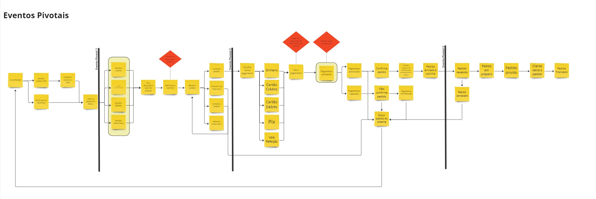
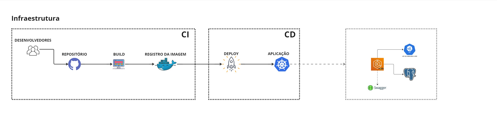
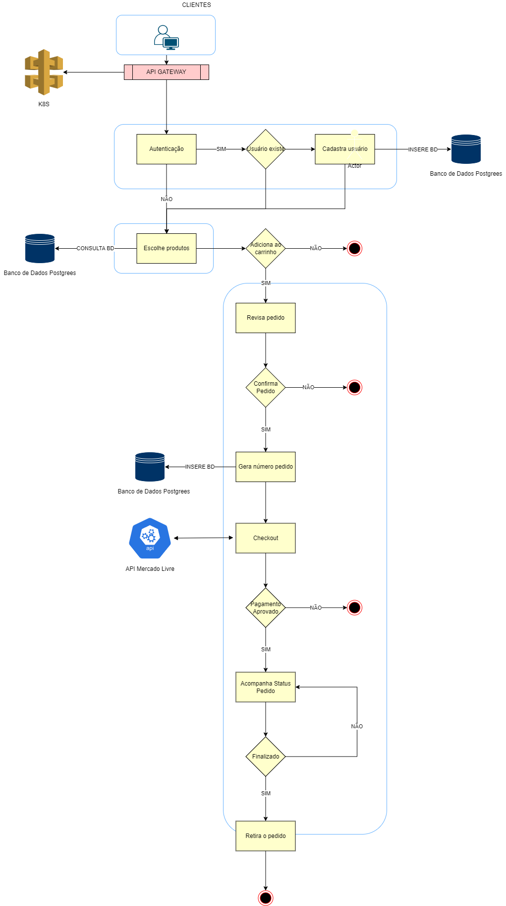

# Tech-Challenge - Grupo 38-7SOAT

Este é o projeto desenvolvido durante a fase I e atualizado durante a fase II do curso de pós-graduação em arquitetura de software da FIAP.

Membros do grupo:
* Ketlin Fabri dos Santos – RM35453
* Lucas Antonio dos Santos – RM354629
* Luan Lopes da Silva – RM356317
* Matheus Akio Santos Ishiguro – RM354952

## Propósito do projeto

Implementar um sistema de gerenciamento de pedidos para uma empresa do setor alimentício.

## Stack utilizada

* Node.js v18
* TypeScript
* Postgresql
* Docker
* Kubernetes


## Instalação do projeto

Este projeto está preparado para execução em um ambiente Docker. Portanto, será necessária apenas a instalação do Docker e/ou Kubernetes, sem a necessidade de instalar o projeto ou o banco de dados PostgreSQL manualmente.

Caso não tenha o Docker instalado, siga as instruções para seu sistema operacional na [documentação oficial do Docker](https://docs.docker.com/get-docker/).


## Iniciar a aplicação

Para iniciar os serviços com o docker-compose, utilize o comando abaixo na raiz do repositório do projeto:


```sh
docker compose up -d
```

O Docker compose irá criar 2 containers, sendo o primeiro com o database e o segundo com a nossa aplicação em Node.

O container do database será automaticamente inicializado com as tabelas necessárias e alguns dados para testes.

O container com a aplicação será gerado por uma build usando o `node:20.13.1-alpine` e o mesmo utilizará a porta `3000` para os endpoints.

Todas as variáveis de ambiente necessárias estão expostas no arquivo `.env`. Nenhuma alteração nesse arquivo é necessária para a total execução da versão 1.0.

Para facilitar a comunicação entre a aplicação e o banco de dados, foi criado uma network no docker-compose.

## Desenvolvimento do projeto

### Diagramas de fluxo

Foram utilizadas técnicas de Domain Driven Design para definição dos fluxos:

- Identificação do objeto principal e organização dos eventos


- Eventos Pivotais


- Diagrama de infraestrutura


- Requisitos de negócios


Todos os diagramas apresentados estão disponíveis no [Miro](https://miro.com/app/board/uXjVKUHWBkY=/?share_link_id=42148422473).

## Swagger
Todos os endpoints estão disponíveis para consulta via [Swagger](http://localhost:3000/api-docs/).
